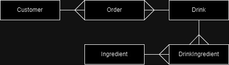

# AlcStore
A Relational Database Project, to build an drink retail shop targeted at selling drinks to those that are in need

## Real World Problem
For some age groups, gaining access to drinks can be extremely challenging. This presents a significant issue, as drinks is not only enjoyed for its taste but is also sought after as a means of coping with life's hardships. Denying access to drinks leaves these individuals feeling deprived and struggling, creating an inequitable experience in society. 

Addressing this imbalance is crucial to ensuring fair and equal treatment. A solution is needed to mitigate this issue and improve access for these groups, helping to alleviate their suffering and enhancing their quality of life.

## ERD plan
Customer( **CustomerID**, CustomerName, CustomerPhone, CustomerBankAccount )

Order( <u>**CustomerID**</u>, <u>**DrinkType**</u>, amount, date, price )

Drink( **DrinkType**, rating, stock )

DrinkIngredient( <u>**DrinkType**</u>, <u>**Ingredient**</u> )

Ingredient( **Ingredient**, description)

